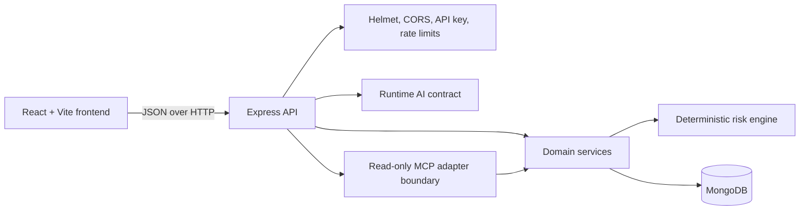

# SupplyGuard AI architecture

## Components

| Component | Technology | Responsibility |
|---|---|---|
| Frontend | React, React Router, Vite, Tailwind CSS | Responsive operations workspace and API client |
| Backend API | Node.js, Express | Routing, validation, security middleware, and response serialization |
| Domain services | JavaScript services | Shipment, disruption, fleet, sensor, dashboard, cold-chain, and assistant orchestration |
| Risk engine | Deterministic JavaScript module | Explainable scoring, rule evidence, risk levels, and review actions |
| Database | MongoDB through Mongoose | Synthetic shipments, disruptions, vehicles, sensor logs, and recommendations |
| Runtime AI | Provider-neutral contract | Trusted context and validated response boundary; disabled by default |
| MCP | Read-only tool abstraction | Allowlisted service calls for a future MCP transport; no transport is installed |

## Data flow

1. The React UI requests JSON from the Express API.
2. Controllers validate query parameters and delegate to domain services.
3. Services use fixed-field Mongoose filters and bounded pagination.
4. Risk endpoints combine shipment, disruption, sensor, and vehicle evidence.
5. The deterministic risk engine returns a score, level, reasons, triggered rules, and action.
6. The UI renders returned records and explicit loading, empty, or error states.

## Security and limitations

- Non-health API routes require the environment-only `API_ACCESS_KEY`.
- CORS uses an explicit origin allowlist; it is not used as authentication.
- JSON bodies, pagination, and assistant requests are bounded.
- Runtime AI credentials remain server-side and runtime AI is disabled by default.
- No arbitrary MongoDB query or write-capable MCP tool is exposed.
- The MVP API key is service-level authentication, not tenant or role authorization.
- The repository uses synthetic data and has no production deployment manifests.
