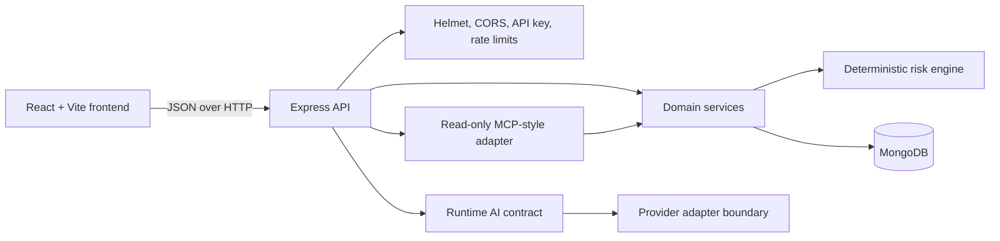
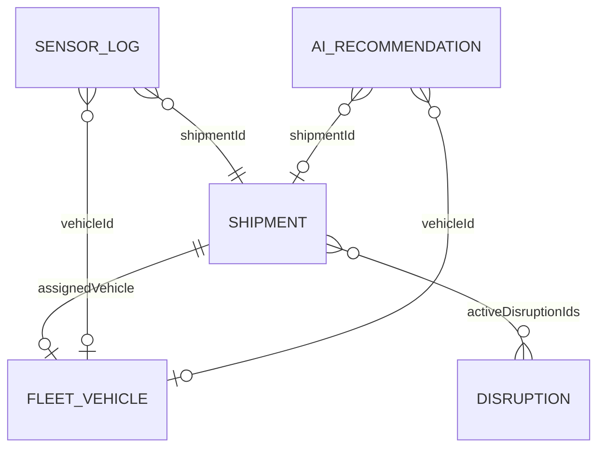
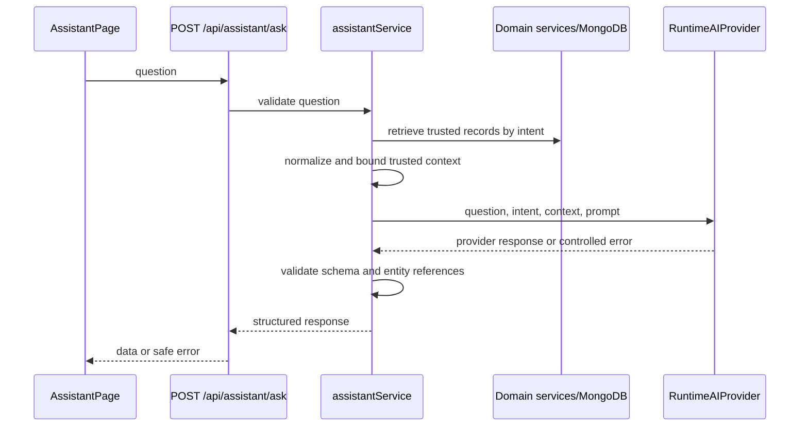
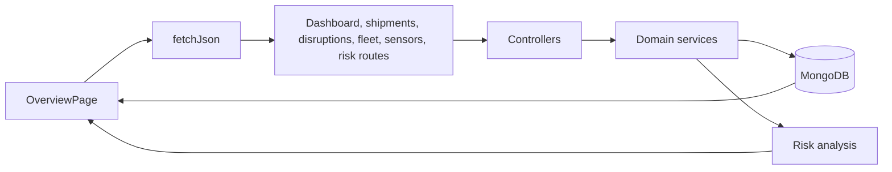

# SupplyGuard AI technical documentation

This document describes the implementation currently present in the repository. It does not
describe planned production integrations as if they were available. SupplyGuard uses synthetic
logistics data for local development, demos, and tests.

## 1. High-level architecture

SupplyGuard is a two-process application:

- A React/Vite browser application renders the operations workspace.
- An Express API owns validation, domain services, deterministic risk calculation, AI-context
  preparation, and MongoDB access.



The runtime AI provider and MCP transport are not fully implemented integrations:

- Runtime AI is disabled by default and the base provider returns a controlled configuration
  error rather than a fabricated answer.
- No MCP SDK, transport, or MCP server is installed. `mcpTools.js` is a validated, read-only
  service adapter boundary.

## 2. Frontend architecture

The frontend is a Vite-built React application using React Router and Tailwind CSS.

### Application shell

- `src/frontend/src/App.jsx` owns the application shell and route table.
- `Sidebar` provides the primary navigation and responsive mobile drawer.
- `Topbar` provides the responsive control-room header.
- `styles.css` defines the shared visual system, panels, tables, badges, state panels, and
  responsive rules.

### Routes

| Route | Component | Behavior |
|---|---|---|
| `/` | `OverviewPage` | Dashboard KPIs, risk distribution, shipments, disruptions, fleet, and sensor summaries |
| `/risk/shipments/:shipmentId` | `RiskDetailPage` | Shipment data and deterministic risk evidence |
| `/fleet` | `FleetPage` | Fleet intelligence, utilization, vehicles, and suggestions |
| `/fleet/vehicles/:vehicleId` | `FleetVehicleDetailPage` | Vehicle detail |
| `/cold-chain` | `ColdChainPage` | Temperature alert list and summary |
| `/cold-chain/shipments/:shipmentId` | `TemperatureShipmentDetailPage` | Shipment temperature history/details |
| `/assistant` | `AssistantPage` | Question submission and structured assistant responses |
| `/shipments` | `PlaceholderPage` | Current workspace placeholder |
| `/disruptions` | `PlaceholderPage` | Current workspace placeholder; live disruption cards are on Overview |

The frontend API client in `src/frontend/src/lib/api.js` provides `fetchJson` and `postJson`.
It sends `VITE_API_ACCESS_KEY` as `X-API-Key` when configured. The browser never connects
directly to MongoDB or a model provider.

### UI data states

Pages use shared loading, empty, and error components. Requests are cancellable through
`AbortController` in the page effects. The UI does not invent data when an API response is
empty or unavailable.

## 3. Backend architecture

The backend is an Express application assembled in `src/backend/src/app.js`.

```mermaid
flowchart TB
    Request[HTTP request] --> Middleware[Helmet, CORS, JSON body limit]
    Middleware --> Health{Health route?}
    Health -->|yes| HealthRoute[/api/health]
    Health -->|no| Auth[API key authentication]
    Auth --> Limits[General or assistant rate limit]
    Limits --> Routes[Express route]
    Routes --> Controller[Controller]
    Controller --> Service[Domain service]
    Service --> Model[Mongoose model]
    Model --> DB[(MongoDB)]
    Service --> RiskEngine[Risk engine when required]
    Routes --> Error[Not-found/error middleware]
```

### Layers

- **Configuration:** `config/env.js` loads environment variables and validates port, API-key,
  and runtime-AI limits.
- **Database:** `config/database.js` connects and disconnects Mongoose.
- **Routes:** route files map URLs to controllers.
- **Controllers:** parse request parameters and serialize service results through `utils/api.js`.
- **Services:** build fixed-field filters, query models, paginate results, and compose domain
  responses.
- **Models:** Mongoose schemas validate and index persisted records.
- **Middleware:** security, rate limits, 404 handling, and sanitized error responses.
- **AI boundary:** `ai/contextBuilder.js`, `trustedContext.js`, prompt templates, response
  contract, provider configuration, and MCP tool definitions.

There are no write controllers in the public API. The synthetic seed script is a separate
development operation.

## 4. Database design

MongoDB collections are declared in `src/backend/src/models`.



### Collections

#### `shipments`

Stores shipment identity and route, cargo type, priority, status, expected delivery, location,
delay, temperature requirements, assigned vehicle, stored risk fields, active disruption
references, and synthetic-data marker. `shipmentId` is unique and matches `SG-<number>`.

Indexes cover status/risk, risk score and delivery, priority/delivery, region, assigned vehicle,
and active disruptions.

#### `disruptions`

Stores `DIS-<number>` identity, type, title, description, severity, status, affected regions,
time window, estimated delay, affected shipment references, source, and synthetic marker.

Indexes cover status/severity, regions, time window, and affected shipments.

#### `fleetVehicles`

Stores `VH-<number>` identity, vehicle type/status, region, capacity, current load, utilization,
temperature capability, location, assignments, maintenance state, and synthetic marker.

Validators prevent load above capacity and enforce bounded location and utilization values.

#### `sensorLogs`

Stores `TEMP-<number>` readings linked to shipments and optionally vehicles. It includes reading
time, temperature, allowed range, excursion flag/severity, sensor identity, location, and
synthetic marker. Schema validation ensures `isExcursion` matches the configured range.

#### `aiRecommendations`

Stores recommendation identity, optional shipment/vehicle references, review type, priority,
message, reason codes, supporting record IDs, source (`deterministic` or `runtime_ai`),
confidence, review status, timestamps, expiry, and synthetic marker.

The current assistant request flow returns a validated response and does not write new runtime
AI recommendations.

## 5. Risk engine design

`src/backend/src/services/riskEngine.js` calculates risk deterministically from an input snapshot.
It does not call AI and does not mutate the database.

### Inputs

- Delay minutes
- Cargo priority
- Disruption severity
- Temperature excursion and cargo type
- Delivery deadline
- Route status
- Vehicle status

Inputs are normalized and validated against allowlisted enum values. Invalid dates, negative
delays, and unsupported statuses fail explicitly.

### Rules

The engine adds points for thresholds such as:

- Delay above 30, 120, and 240 minutes
- High or critical priority
- Low, medium, high, or critical disruption
- Temperature excursion and cold-chain excursion
- Delivery deadline within 6 or 24 hours
- Blocked, disrupted, or delayed route
- Unavailable, maintenance, or offline vehicle

The total is capped at 100.

### Levels and actions

| Score | Level |
|---:|---|
| 0-19 | `LOW` |
| 20-39 | `MEDIUM` |
| 40-64 | `HIGH` |
| 65-100 | `CRITICAL` |

The result includes `riskLevel`, `riskScore`, `riskReasons`, `triggeredRules`,
`recommendedAction`, and `calculatedAt`. Critical risk recommends immediate escalation and
review of alternate capacity or routes. Other actions are review/monitoring guidance only.

`riskAnalysisService.js` combines shipment records with disruption, sensor, and vehicle
evidence before invoking the engine for API responses.

## 6. AI service design

### Current boundary

The assistant flow is:



Supported intent categories include immediate attention, risk explanation, delayed shipments,
idle vehicles, vehicle suggestions, cold-chain alerts, disruptions, and first action.

### Grounding and validation

The prompt contract instructs a future provider to:

- Use only structured application context
- Treat deterministic risk as authoritative
- Separate facts from recommendations
- Avoid fabricated IDs, values, actions, and records
- State when data is unavailable

`responseContract.js` requires answer, facts, affected IDs, risk level, recommendations,
limitations, source references, data availability, and provider identity. It bounds arrays and
item lengths, and rejects affected entities/source IDs absent from trusted context.

### Provider status

`RUNTIME_AI_PROVIDER=disabled` is the default. In this mode the assistant returns a validated
deterministic fallback assembled from trusted application records and labels the provider
`deterministic-fallback`. `external` is a reserved configuration value requiring a future
server-side adapter; no external provider SDK or live adapter is included.

IBM Bob is the development assistant used to work on the repository. IBM Bob is not the runtime
provider and is not called by the application.

## 7. MCP design

MCP transport is not implemented. `src/backend/src/ai/mcpTools.js` is a future-adapter boundary:

- Tool names are allowlisted.
- Inputs and pagination are bounded.
- Shipment identifiers are format-validated.
- Calls go through existing domain services.
- Mongoose models, collection names, database URIs, and credentials are never exposed.
- Every result is marked `readOnly: true`.
- No tool performs a write or accepts an arbitrary MongoDB query.

Defined tool operations include shipment lists, high-risk shipments, shipment details, active
disruptions, available vehicles, temperature alerts, fleet summary, and deterministic shipment
risk. A future MCP transport must preserve this boundary.

## 8. API documentation

The API uses JSON. Successful payloads are wrapped as `{ "data": ... }`; collection endpoints
also include `pagination`.

### Authentication and common behavior

- `GET /api/health` is the public health endpoint.
- Other API routes require `X-API-Key` or `Authorization: Bearer <API_ACCESS_KEY>`.
- `API_ACCESS_KEY` must be at least 16 characters.
- JSON request bodies are limited to 100 KB.
- General API traffic is limited to 120 requests per 15 minutes.
- Assistant traffic is limited to 20 requests per 15 minutes.
- List `limit` values are bounded to 100 by shared pagination helpers.

### Endpoints

| Method | Path | Purpose |
|---|---|---|
| GET | `/api/health` | Health status |
| GET | `/api/shipments` | Paginated shipments with status/risk/priority/region filters |
| GET | `/api/shipments/:shipmentId` | One shipment by `SG-<number>` |
| GET | `/api/disruptions` | Paginated disruption records and filters |
| GET | `/api/fleet` | Paginated fleet records and filters |
| GET | `/api/fleet/intelligence` | Fleet totals, utilization, idle, and overutilized groups |
| GET | `/api/fleet/:vehicleId` | One vehicle by `VH-<number>` |
| GET | `/api/fleet/suggestions?shipmentId=...` | Available vehicle suggestions for manual review |
| GET | `/api/sensors` | Paginated sensor logs and filters |
| GET | `/api/dashboard/summary` | Dashboard aggregate metrics |
| GET | `/api/risk/shipments` | Risk shipments with risk-related filters |
| GET | `/api/risk/shipments/:shipmentId` | Deterministic risk detail and evidence |
| GET | `/api/risk/summary` | Risk distribution/summary |
| GET | `/api/risk/recommendations` | Existing recommendation records |
| GET | `/api/cold-chain/summary` | Cold-chain aggregate metrics |
| GET | `/api/cold-chain/alerts` | Paginated temperature alerts |
| GET | `/api/cold-chain/shipments/:shipmentId` | Shipment temperature detail |
| POST | `/api/assistant/ask` | Validated assistant question and structured response |

The assistant request body is:

```json
{
  "question": "Which shipments need immediate attention?"
}
```

The question must be non-empty, at most 1000 characters, and match a supported logistics intent.

## 9. Data flow

### Dashboard flow



The overview makes independent read requests and renders available results through loading,
empty, and error states. No frontend component calculates risk or queries MongoDB.

### Assistant flow

The assistant selects retrieval based on intent. Retrieval calls the appropriate service, then
`contextBuilder.js` keeps only approved fields and `trustedContext.js` bounds the context. The
provider receives the question, intent, context, and generated prompt. The response validator
checks the provider output before it is returned to the browser.

### Cold-chain flow

Cold-chain services locate temperature-controlled shipments, retrieve related sensor logs,
sort readings by time, calculate latest readings and excursions, and return bounded alert/detail
responses.

## 10. Error handling

Application errors use `AppError(statusCode, message, code)`. The final middleware returns:

```json
{
  "error": {
    "code": "INVALID_QUERY",
    "message": "limit must be an integer between 1 and 100"
  }
}
```

Known behavior:

- Invalid input returns structured 400 errors.
- Missing resources return service-specific 404 errors.
- Authentication failures return 401; missing API configuration returns 503.
- Unknown routes return a generic 404 without echoing the requested URL.
- Provider timeout/unavailable/invalid responses return stable AI error codes.
- Unexpected 5xx responses return `Internal server error` to clients.
- Server logs retain only structured error code/status/message; prompts, provider bodies, and
  secrets are not intentionally logged.

The frontend displays API errors through shared error states and retry controls where supported.

## 11. Security approach

- `.env` files, logs, coverage, and build output are ignored; only example environment files are
  tracked.
- No real API keys, private keys, or credential-bearing MongoDB URLs are included.
- API keys are compared with `crypto.timingSafeEqual`.
- The API binds to `127.0.0.1` by default.
- Helmet adds standard HTTP security headers.
- CORS uses an explicit allowlist and is not treated as authentication.
- JSON bodies and list pagination are bounded.
- General and assistant endpoints have separate rate limits.
- MongoDB filters use fixed fields and validated values; no arbitrary query/operator input is
  exposed.
- Runtime AI credentials remain server-side.
- Trusted AI context contains an allowlisted subset of domain fields.
- AI output cannot introduce untrusted shipment/vehicle/source IDs.
- MCP tools are read-only and do not expose database handles or arbitrary queries.

The MVP API key is service-level authentication only. It does not provide user identity,
tenant isolation, or role-based authorization. Production deployment should add OIDC/JWT
authentication and enforce tenant/region/role checks in the service/query layer.

## 12. Testing strategy

The backend uses Node's built-in test runner:

- Risk engine and risk analysis tests
- Fleet intelligence tests
- Cold-chain tests
- Runtime AI contract and context/prompt tests
- Assistant orchestration, timeout, provider-error, and grounding tests
- MCP tool validation and read-only boundary tests

The repository QA process also covers:

- Backend module loading
- Synthetic seed behavior
- API smoke checks
- Empty database and unavailable MongoDB behavior
- Assistant provider-disabled fallback
- Secret-shaped pattern scans
- Frontend production build
- Desktop/mobile route and overflow checks
- Loading, error, and accessibility heuristics

No real external provider end-to-end test is included because no provider credentials are
committed or configured.

## 13. Deployment strategy

### Current local/demo deployment

1. Install dependencies in `src/backend` and `src/frontend`.
2. Start MongoDB.
3. Copy and edit environment examples without committing secrets.
4. Seed synthetic records.
5. Run `npm run dev` in `src/backend` and `src/frontend`.
6. Verify `/api/health`, then open the Vite URL.

### Production considerations

The repository does not include container images, orchestration manifests, CI deployment files,
TLS configuration, or a managed secret integration. A production deployment therefore needs:

- HTTPS and a protected reverse proxy/API gateway
- OIDC/JWT identity and tenant/role authorization
- Managed secrets for API, MongoDB, and any runtime provider
- Least-privilege MongoDB credentials and network restrictions
- A production MongoDB backup/monitoring plan
- Redacted structured logs, metrics, tracing, and alerting
- Secure frontend build/deployment configuration
- Approved runtime AI adapter and provider egress policy, if enabled
- Security, accessibility, and browser regression checks in CI

## 14. Known limitations

- All included operational records are synthetic.
- Runtime AI is disabled by default; no external provider adapter is implemented.
- MCP transport and SDK are not implemented.
- API authentication is a shared MVP key, not identity or tenant authorization.
- The Disruptions navigation route is a placeholder; live disruption cards are available on the
  Overview page and through API endpoints.
- The application is read-only for operational workflows. Vehicle suggestions are manual review
  guidance and do not assign vehicles.
- No deployment manifests or production infrastructure are included.
- Automated axe/browser accessibility tests are not part of the repository.
- No real provider end-to-end test can run without separately approved credentials.
